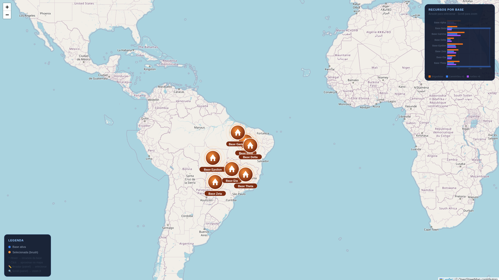

# d3-map-icon

Dashboard interativo de resposta a emergências com marcadores customizados renderizados via D3.js sobre um mapa Leaflet. Desenvolvido para visualização de bases de combate a incêndios no Brasil.



## Stack

- **[Leaflet 1.9.4](https://leafletjs.com/)** — mapa interativo com tiles OpenStreetMap
- **[D3.js v7](https://d3js.org/)** — marcadores SVG customizados e gráfico de barras
- Sem dependências de build — HTML/CSS/JS puro com CDN

## Como rodar

```bash
cd map_icon
python3 -m http.server 8080
# acesse http://localhost:8080
```

## Funcionalidades

### Mapa
- Marcadores SVG com gradiente radial (azul = normal, laranja = selecionado)
- Anel de pulso animado por marcador (transição recursiva D3)
- Ícone de barraca/acampamento-base em branco
- Pílula com nome da base abaixo de cada marcador
- Tooltip no hover com dados de recursos (brigadistas, caminhões, aviões)
- Redesenho automático ao zoom e pan via eventos Leaflet
- Animação fly-to ao clicar em um marcador

### Gráfico (painel lateral)
- Gráfico de barras empilhadas horizontal (D3) com recursos por base
- 3 categorias: Brigadistas, Caminhões (×3), Aviões (×8)
- **Brush vertical** para filtrar/selecionar bases no mapa
- **Scroll** para zoom no eixo X

## Estrutura

```
map_icon/
├── index.html   # aplicação completa (HTML + CSS + JS embutidos)
├── print.png    # screenshot de preview
└── README.md
```

## Dados

8 bases de resposta distribuídas pelo Brasil (MA, PI, PA, TO, MT, MS, GO, MG), cada uma com:

| Campo        | Descrição                     |
|--------------|-------------------------------|
| `nome`       | Nome da base                  |
| `estado`     | UF                            |
| `brigadistas`| Número de brigadistas         |
| `caminhoes`  | Número de caminhões           |
| `avioes`     | Número de aviões              |
| `pos`        | Coordenadas `{ lat, lng }`    |

**Keywords:** Brasil, Brazil, d3, d3js, leaflet, markers, mapa, incêndio, suzano
