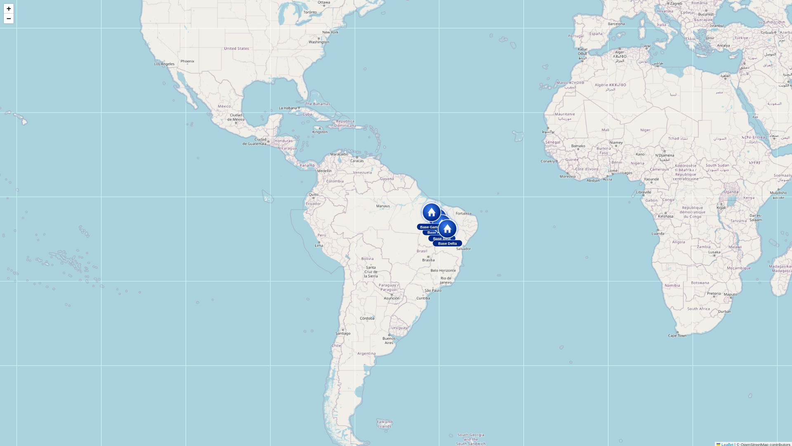

# d3-map-icon
Custom base markers rendered with D3.js over a Leaflet map.



# Usage

```
cd map_icon
python3 -m http.server 8080
# open http://localhost:8080
```

# Features

- Animated pulse ring per marker (D3 recursive transition)
- Radial gradient circle with glow effect
- Tent/base-camp icon in white
- Name label pill below each marker
- Hover tooltip with team data (brigadistas, caminhões, aviões)
- Auto-redraws on map zoom and pan via Leaflet events

**Keyword:** Brasil, Brazil, d3, d3js, leaflet, markers, mapa, incêndio, suzano
